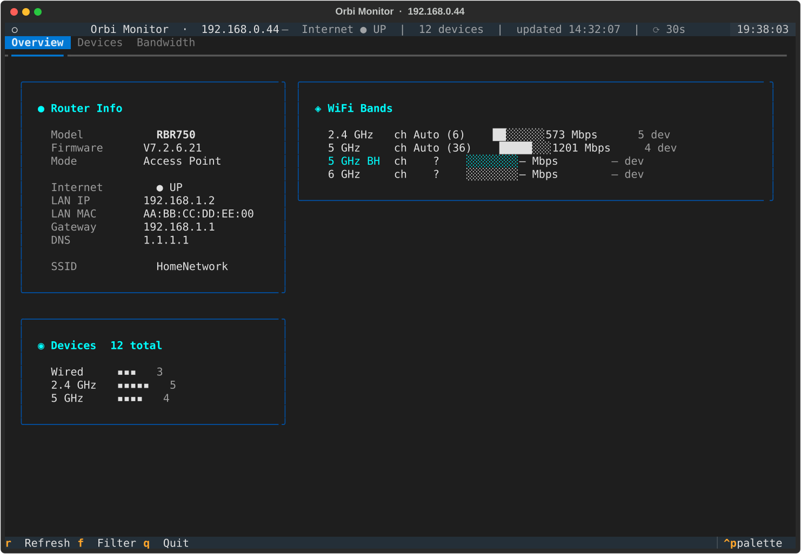
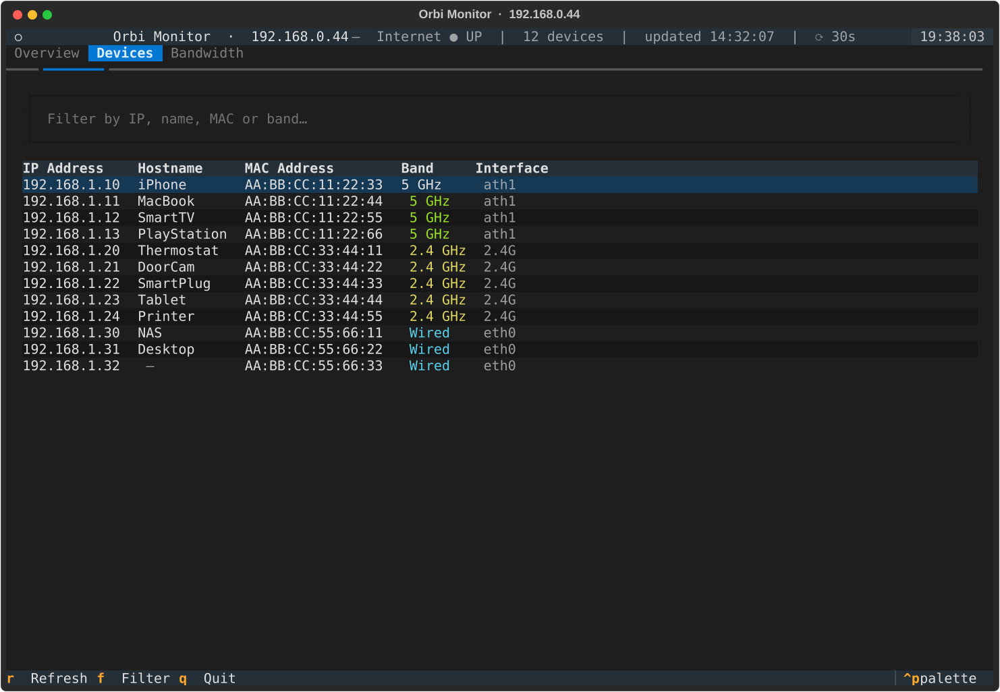
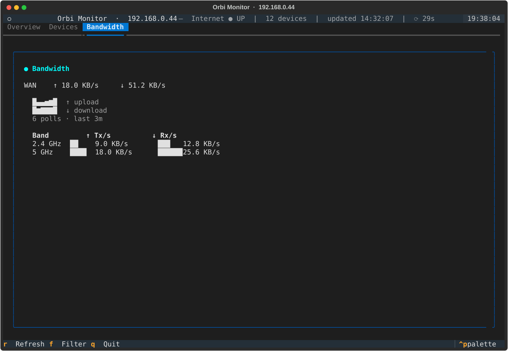

# orbytwowee

A terminal dashboard for Netgear Orbi mesh routers (RBR750 and similar). Shows router info, connected devices, Wi-Fi band details, and a live bandwidth graph — all in the terminal, auto-refreshing every 30 seconds.

## Screenshots

### Overview


### Devices


### Bandwidth


## Features

- **Overview tab** — router model, firmware, internet status, SSID, gateway, DNS, MAC, and a per-band channel/speed breakdown with device counts
- **Devices tab** — full connected device list (IP, hostname, MAC, band, interface) with live filter
- **Bandwidth tab** — rolling WAN upload/download sparkline (up to 30 minutes of history) and current Tx/Rx rates per Wi-Fi band
- Auto-refreshes every 30 seconds; manual refresh with `r` or `F5`
- Handles the Orbi XSRF two-step auth handshake automatically

## Setup

```bash
python3 -m venv .venv
.venv/bin/pip install -r requirements.txt
```

Edit the two constants at the top of `orbitui.py`:

```python
ROUTER_HOST = "192.168.0.1"               # your Orbi's IP
AUTH = HTTPBasicAuth("admin", "password")  # your admin password
```

Then run:

```bash
.venv/bin/python orbitui.py
```

## Key bindings

| Key | Action |
|-----|--------|
| `r` / `F5` | Refresh now |
| `f` | Focus device filter |
| `q` | Quit |

## Development

```bash
.venv/bin/pip install -r requirements-dev.txt

# Run tests
.venv/bin/pytest

# Lint + format
.venv/bin/ruff check .
.venv/bin/ruff format .

# Type check
.venv/bin/mypy orbitui.py
```

## Requirements

- Python 3.11+
- Netgear Orbi router with admin web UI accessible on your local network
